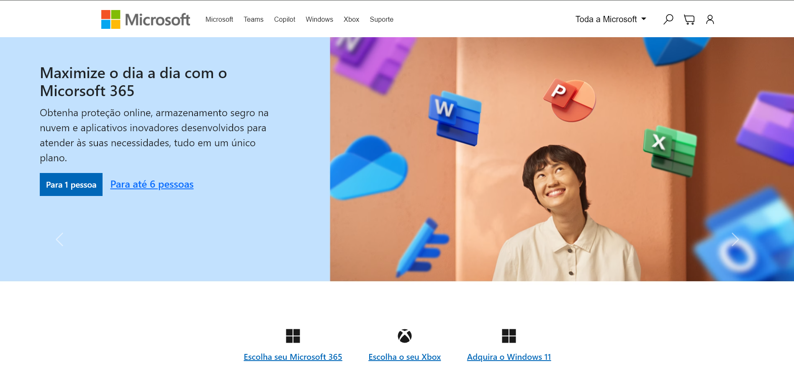

# Microsoft

**Clone da Página da Microsoft!** Este é um projeto desenvolvido com o objetivo de recriar a interface visual do site da Microsoft, utilizando tecnologias web modernas. Ele replica fielmente o design da página oficial da Microsoft, com foco em telas maiores.

---

## 🚀 **Funcionalidade**

O projeto é uma réplica estática da página inicial da Microsoft, desenvolvido para telas de computadores. Atualmente, ele não possui responsividade para dispositivos menores, mas há planos futuros para essa implementação.

---

## 📸 **Demonstração do Layout**

Veja abaixo uma prévia do layout do projeto:

---
## Link do Projeto 
- http://microsoftproject.vercel.app/

---

## 🛠️ **Tecnologias Utilizadas**

- **HTML5:** Estruturação semântica do conteúdo.
- **CSS3:** Estilização avançada.
- **Bootstrap:** Auxílio na criação de componentes visuais modernos.

---

## 🎯 **Objetivos**

- **Prática de habilidades front-end:** Criar um site com atenção ao layout original da Microsoft.
- **Aperfeiçoamento técnico:** Desenvolver e planejar futuras melhorias no projeto.
- **Inspiração real:** Aplicar conceitos baseados em um site reconhecido globalmente.

